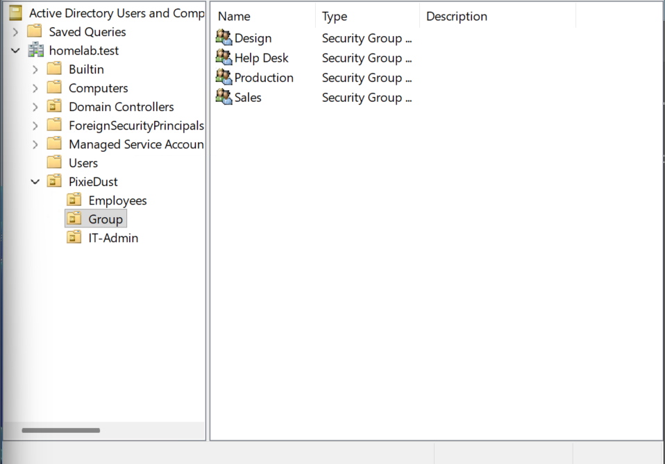
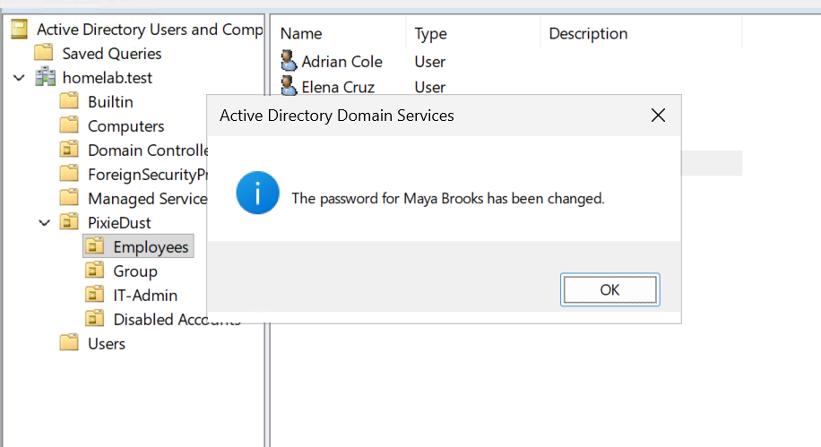
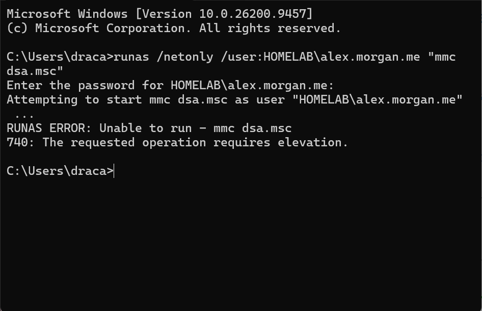
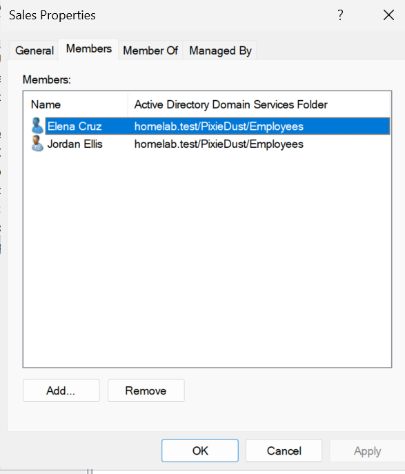
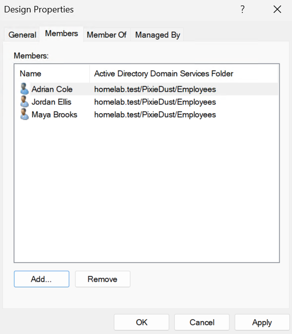
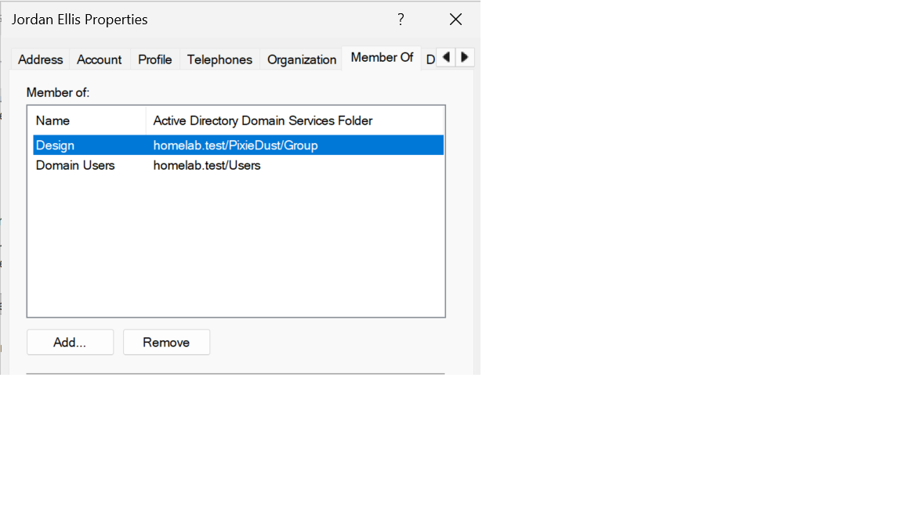
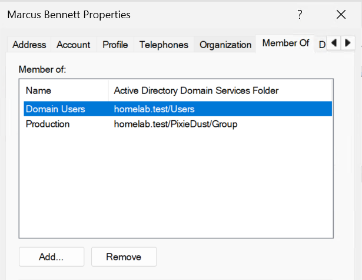
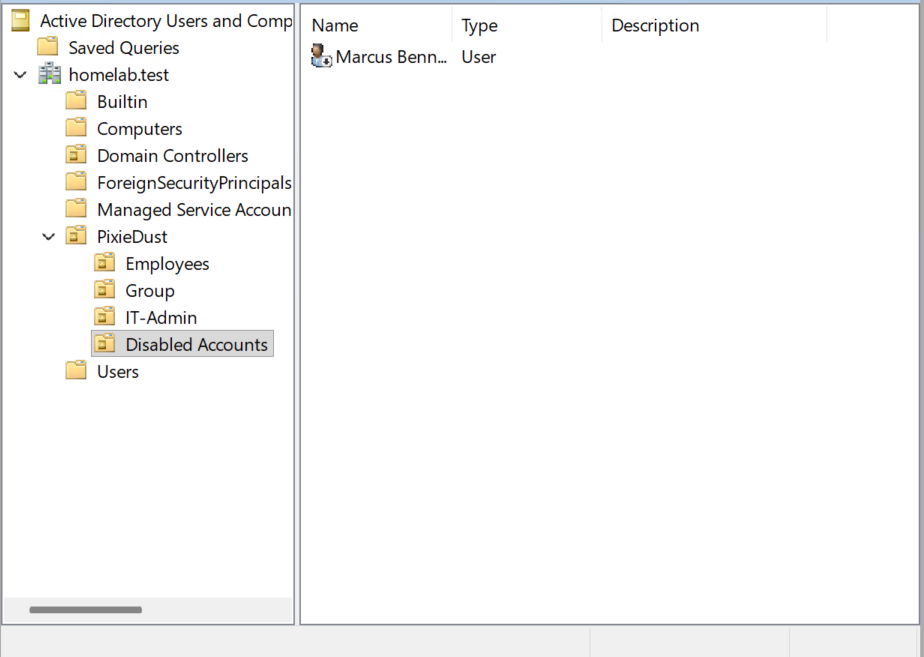

# PixieDust Active Directory Help Desk Lab

## Overview
This home lab stimulates IT help desk tasks for PixieDust (a fictional company). I used Active Directory to organize employees, manage group membership, delegate password-reset permissions, and practice offboarding.

All employees and support scenarios are fictional.

## Environment
- Microsoft Hyper-V
- Windows Server virtual machine
- Active Directory Domain Services
- Domain: homelab.test
- Active Directory Users and Computers

## Directory Structure
The PixieDust organizational unit contains:
-Employees - employee accounts
-Group - Design, Help Desk, Production, and Sales security groups
-IT-Admin - the help desk account and a permission-test acount
-Disabled-Accounts - offboarded accounts

## Completed Support Scenarios 

### 1. Employee Account Setup
Created fictional employee accounts and department security groups.
Added employees to groups based on their roles.

### 2. Delegated Password Reset
Delegated password-reset permissions to the Help Desk group for the Employees OU. Using Alex Morgan's account, successfully reset Maya Brook's password and required a password change at next sign-in

### 3. Permission Boundary Test
Using Alex's account, attempted to reset the password of a test user in IT-Admin, outside the delegated Employees OU.

Result: Access was denied, demonstrating the permission boundary.

### 4. Department Transfer
Changed Jordan Eliis's group membership from Sales to Design while retaining Domain Users membership.

### 5. Employee Offboarding
Disabled Marcus Bennett's account, removed Production group membership, and moved the account into Disabled-Accounts.

## What I Learned
- OUs organize directory objects; security groups can be assigned access.
- Moving a user between OUs does not change their memeberships.
- Delegation allows help desk tasks without Domain Admin membership.
- Testing denied actions helps verify permission boundaries.
- Offboarding includes disabling accounts and reviewing group access.

## Validation Scope
I tested password-reset permissions through Active Directory.
Employee Workstation sign-in and shared-folder access have not yet been tested. No separate client VM was used for these scenarios.

### Active Directory Structure
Pixidust organizational units and security groups used throughout the lab.

### Delegated Password Reset
Successful password reset of Maya Brooks using delegated Help Desk permissions.

### Permission Boundary Test
Password reset attempt on a user outside the delegated Employees OU was denied, confirming that the Help Desk permission was properly scoped.

### Department Transfer
Jordan Ellis was transferred from the Sales group to the Design group while retaining Domain Users membership.

**Before transfer:**

**Transfer:**

**After transfer:**

### Employee Offboarding
Marcus Bennett's account was disabled, Production group access was removed, and the account

**Before offboarding:**

**Account disabled:**

**Group membership updated:**

**Disabled account propeties:**

**Moved to Disabled-Account OU:**

